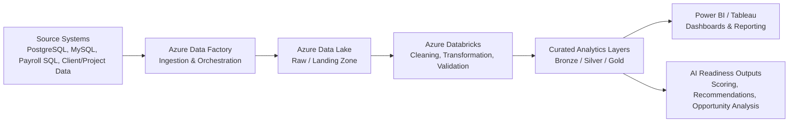

# AI Workforce & Project Readiness Analysis


## My Role & Contribution

In this analytics project, I worked on structuring project, employee, timesheet, payroll, client, skills, and training-related data into a business-ready analytical framework. The goal was to help leadership understand workforce allocation, project effort, client workload, delivery risk, and AI-readiness opportunities across consulting projects.

My work focused on analyzing data from multiple operational sources, cleaning inconsistent project and employee records, standardizing client and technology fields, building SQL logic for project-hour and payroll analysis, and designing metrics that could support leadership reporting and AI investment planning.

The analysis helped identify which projects had high manual effort, which employees had strong exposure to data/cloud/automation technologies, and which project areas could be evaluated for future AI Agent enablement or workforce upskilling.


## Project Overview

In an IT consulting environment, leadership often needs visibility into how employees are allocated across projects, how many hours are being invested, which clients consume the most effort, what technologies are being used, and where automation or AI Agent opportunities may exist.

This project focuses on building an analytics framework to evaluate:

- Employee project allocation
- Client and project workload
- Payroll and labor cost impact
- Project completion timelines
- Skills and technology exposure
- AI-readiness by employee
- AI opportunity by project/use case
- Training recommendations for AI Agent development

The analysis supports strategic decisions around where a company should invest in AI, which projects can be improved through automation, and which employees can be trained or upskilled based on their existing experience.

---

## Business Problem

A consulting company is managing multiple client projects across different domains, technologies, and teams. Leadership wants to understand:

- Which projects require the highest effort
- Which employees are spending the most time on specific clients or tools
- Which projects are close to completion
- Which skills are already present internally
- Which employees have exposure to AI-related tools or data projects
- Which use cases can be converted into AI Agent opportunities
- Which employees are best suited for AI training based on project history, education, and technical background

The business challenge is that the data is spread across multiple systems such as timesheets, payroll, HR records, project management tools, client systems, skills matrices, and training records.

---

## Business Questions Answered

This framework is designed to answer questions such as:

1. Which projects have the highest employee-hour investment?
2. Which clients consume the most consulting effort?
3. Which projects are nearing completion?
4. Which employees are working repeatedly on the same client or project type?
5. Which technologies are most common across current projects?
6. Which employees already have exposure to AI, data, automation, cloud, or analytics?
7. Which projects have repetitive tasks that can be automated?
8. Which project use cases are good candidates for AI Agents?
9. Which employees should be prioritized for AI Agent training?
10. What is the estimated business value of investing in AI enablement?

---


## Analytics Approach

The analysis follows this process:

```text
1. Collect data from HR, timesheet, payroll, project, client, and skills systems
2. Clean employee, project, client, and technology names
3. Remove duplicate timesheet and payroll records
4. Standardize project status and role categories
5. Join employee, project, client, skills, and payroll data
6. Calculate effort, cost, utilization, and project completion metrics
7. Identify repetitive work and automation-friendly project patterns
8. Score employees for AI-readiness based on skills, education, project exposure, and training
9. Score projects for AI Agent opportunity based on effort, repetition, documentation, and business value
10. Build dashboards and recommendation outputs for leadership
```

---

# 1. Data Cleaning and Standardization

## Purpose

Before analytics can be trusted, project, employee, client, and skill data must be standardized.

Common issues include:

- Duplicate employee records
- Different spellings of client names
- Multiple project naming formats
- Missing project status
- Inconsistent technology names
- Timesheet duplicates
- Payroll records not aligned to project months
- Skill names entered manually in different formats

---

## Example SQL: Standardize Project and Client Names

```sql
WITH cleaned_projects AS (
    SELECT
        project_id,

        TRIM(UPPER(project_name)) AS standardized_project_name,

        TRIM(UPPER(client_name)) AS standardized_client_name,

        CASE
            WHEN LOWER(project_status) IN ('active', 'in progress', 'ongoing') THEN 'Active'
            WHEN LOWER(project_status) IN ('completed', 'closed', 'done') THEN 'Completed'
            WHEN LOWER(project_status) IN ('on hold', 'paused') THEN 'On Hold'
            ELSE 'Review'
        END AS standardized_project_status,

        project_start_date,
        project_end_date,
        completion_percent

    FROM raw_project_data
)

SELECT *
FROM cleaned_projects;
```

---

# 2. Employee Project Allocation Analysis

## Purpose

Understand how many hours employees are investing across projects and clients.

This helps leadership identify:

- High-effort projects
- Overallocated employees
- Client concentration risk
- Repeated work patterns
- Employees with strong domain exposure

---

## Example SQL: Employee Hours by Project and Client

```sql
WITH employee_project_hours AS (
    SELECT
        e.employee_id,
        e.employee_name,
        e.role,
        e.department,

        p.project_id,
        p.project_name,
        c.client_name,

        DATE_TRUNC('month', t.work_date) AS work_month,

        SUM(t.hours_worked) AS total_hours_worked,
        SUM(CASE WHEN t.billable_flag = 'Y' THEN t.hours_worked ELSE 0 END) AS billable_hours,
        SUM(CASE WHEN t.billable_flag = 'N' THEN t.hours_worked ELSE 0 END) AS non_billable_hours

    FROM fact_timesheet t

    INNER JOIN dim_employee e
        ON t.employee_id = e.employee_id

    INNER JOIN dim_project p
        ON t.project_id = p.project_id

    INNER JOIN dim_client c
        ON p.client_id = c.client_id

    GROUP BY
        e.employee_id,
        e.employee_name,
        e.role,
        e.department,
        p.project_id,
        p.project_name,
        c.client_name,
        DATE_TRUNC('month', t.work_date)
)

SELECT *
FROM employee_project_hours
ORDER BY
    work_month DESC,
    total_hours_worked DESC;
```

---

# 3. Payroll and Project Cost Analysis

## Purpose

Understand labor cost by project, client, and employee.

This helps evaluate:

- Which projects are expensive to deliver
- Which clients require higher labor investment
- Where automation can reduce manual effort
- Which projects have high cost but low automation maturity

---

## Example SQL: Project Labor Cost and Billing Value

```sql
WITH project_labor_cost AS (
    SELECT
        t.project_id,
        p.project_name,
        c.client_name,

        t.employee_id,
        e.employee_name,
        e.role,

        DATE_TRUNC('month', t.work_date) AS work_month,

        SUM(t.hours_worked) AS total_hours_worked,

        SUM(t.hours_worked * pr.hourly_cost) AS estimated_payroll_cost,

        SUM(
            CASE
                WHEN t.billable_flag = 'Y' THEN t.hours_worked * pr.billing_rate
                ELSE 0
            END
        ) AS estimated_billable_revenue

    FROM fact_timesheet t

    INNER JOIN dim_project p
        ON t.project_id = p.project_id

    INNER JOIN dim_client c
        ON p.client_id = c.client_id

    INNER JOIN dim_employee e
        ON t.employee_id = e.employee_id

    INNER JOIN fact_payroll pr
        ON t.employee_id = pr.employee_id
       AND DATE_TRUNC('month', t.work_date) = pr.payroll_month

    GROUP BY
        t.project_id,
        p.project_name,
        c.client_name,
        t.employee_id,
        e.employee_name,
        e.role,
        DATE_TRUNC('month', t.work_date)
),

project_profitability AS (
    SELECT
        project_id,
        project_name,
        client_name,
        work_month,

        SUM(total_hours_worked) AS project_hours,
        SUM(estimated_payroll_cost) AS project_payroll_cost,
        SUM(estimated_billable_revenue) AS project_billable_revenue,

        SUM(estimated_billable_revenue) - SUM(estimated_payroll_cost) AS estimated_project_margin,

        CASE
            WHEN SUM(estimated_billable_revenue) = 0 THEN 0
            ELSE
                (
                    SUM(estimated_billable_revenue) - SUM(estimated_payroll_cost)
                )
                / NULLIF(SUM(estimated_billable_revenue), 0)
        END AS estimated_margin_pct

    FROM project_labor_cost
    GROUP BY
        project_id,
        project_name,
        client_name,
        work_month
)

SELECT *
FROM project_profitability
ORDER BY
    work_month DESC,
    project_hours DESC;
```

---

# 4. Project Completion and Resource Risk

## Purpose

Identify which projects are close to completion and whether remaining work is properly staffed.

This helps leadership answer:

- Which projects are nearing delivery?
- Which employees are still assigned?
- Which projects may be delayed?
- Which clients need delivery attention?

---

## Example SQL: Projects Near Completion

```sql
SELECT
    p.project_id,
    p.project_name,
    c.client_name,
    p.project_status,
    p.project_start_date,
    p.project_end_date,
    p.completion_percent,

    COUNT(DISTINCT t.employee_id) AS active_employee_count,
    SUM(t.hours_worked) AS recent_hours_worked,

    DATEDIFF('day', CURRENT_DATE, p.project_end_date) AS days_until_project_end,

    CASE
        WHEN p.completion_percent >= 90
             AND DATEDIFF('day', CURRENT_DATE, p.project_end_date) <= 30
            THEN 'Near Completion'

        WHEN p.completion_percent < 75
             AND DATEDIFF('day', CURRENT_DATE, p.project_end_date) <= 30
            THEN 'Delivery Risk'

        WHEN p.project_end_date < CURRENT_DATE
             AND p.project_status <> 'Completed'
            THEN 'Overdue'

        ELSE 'On Track'
    END AS project_delivery_status

FROM dim_project p

INNER JOIN dim_client c
    ON p.client_id = c.client_id

LEFT JOIN fact_timesheet t
    ON p.project_id = t.project_id
   AND t.work_date >= DATEADD(day, -30, CURRENT_DATE)

GROUP BY
    p.project_id,
    p.project_name,
    c.client_name,
    p.project_status,
    p.project_start_date,
    p.project_end_date,
    p.completion_percent;
```

---

# 5. Employee Skill and Technology Exposure Analysis

## Purpose

Understand which employees have worked with specific tools, technologies, project types, and AI-related capabilities.

This helps identify who can be trained faster for AI Agent development or AI-enabled projects.

---

## Example SQL: Employee Technology Exposure

```sql
WITH employee_skill_profile AS (
    SELECT
        e.employee_id,
        e.employee_name,
        e.role,
        e.education_level,
        e.years_experience,

        s.skill_name,
        s.skill_category,
        es.proficiency_level,
        es.years_used,
        es.last_used_date,

        CASE
            WHEN LOWER(s.skill_name) IN (
                'python',
                'sql',
                'machine learning',
                'nlp',
                'generative ai',
                'azure databricks',
                'snowflake',
                'power bi',
                'tableau',
                'automation'
            )
            THEN 'AI / Data / Automation Related'
            ELSE 'Other'
        END AS ai_related_skill_flag

    FROM dim_employee e

    LEFT JOIN bridge_employee_skill es
        ON e.employee_id = es.employee_id

    LEFT JOIN dim_skill s
        ON es.skill_id = s.skill_id
)

SELECT *
FROM employee_skill_profile
ORDER BY
    employee_name,
    skill_category,
    proficiency_level DESC;
```

---

# 6. AI-Readiness Score by Employee

## Purpose

Create a score to identify employees who may be strong candidates for AI Agent training.

The score considers:

- SQL/Python exposure
- Cloud/data platform experience
- Automation experience
- Project delivery experience
- AI/ML training
- Education background
- Recent technology usage

---

## Example SQL: Employee AI-Readiness Score

```sql
WITH employee_project_summary AS (
    SELECT
        e.employee_id,
        e.employee_name,
        e.role,
        e.education_level,
        e.years_experience,

        COUNT(DISTINCT t.project_id) AS project_count,
        COUNT(DISTINCT p.client_id) AS client_count,
        SUM(t.hours_worked) AS total_project_hours

    FROM dim_employee e

    LEFT JOIN fact_timesheet t
        ON e.employee_id = t.employee_id

    LEFT JOIN dim_project p
        ON t.project_id = p.project_id

    GROUP BY
        e.employee_id,
        e.employee_name,
        e.role,
        e.education_level,
        e.years_experience
),

employee_skill_summary AS (
    SELECT
        es.employee_id,

        MAX(CASE WHEN LOWER(s.skill_name) = 'python' THEN 1 ELSE 0 END) AS has_python,
        MAX(CASE WHEN LOWER(s.skill_name) = 'sql' THEN 1 ELSE 0 END) AS has_sql,
        MAX(CASE WHEN LOWER(s.skill_name) LIKE '%machine learning%' THEN 1 ELSE 0 END) AS has_ml,
        MAX(CASE WHEN LOWER(s.skill_name) LIKE '%generative ai%' THEN 1 ELSE 0 END) AS has_gen_ai,
        MAX(CASE WHEN LOWER(s.skill_name) LIKE '%automation%' THEN 1 ELSE 0 END) AS has_automation,
        MAX(CASE WHEN LOWER(s.skill_name) LIKE '%cloud%' THEN 1 ELSE 0 END) AS has_cloud,
        MAX(CASE WHEN LOWER(s.skill_name) LIKE '%databricks%' THEN 1 ELSE 0 END) AS has_databricks,
        MAX(CASE WHEN LOWER(s.skill_name) LIKE '%snowflake%' THEN 1 ELSE 0 END) AS has_snowflake,

        COUNT(DISTINCT s.skill_id) AS total_skills_count

    FROM bridge_employee_skill es

    INNER JOIN dim_skill s
        ON es.skill_id = s.skill_id

    GROUP BY
        es.employee_id
),

training_summary AS (
    SELECT
        employee_id,

        MAX(
            CASE
                WHEN LOWER(training_category) IN ('ai', 'machine learning', 'automation', 'data')
                THEN 1 ELSE 0
            END
        ) AS completed_ai_related_training,

        COUNT(DISTINCT training_name) AS total_training_count

    FROM fact_training

    GROUP BY
        employee_id
),

ai_readiness_score AS (
    SELECT
        eps.employee_id,
        eps.employee_name,
        eps.role,
        eps.education_level,
        eps.years_experience,
        eps.project_count,
        eps.client_count,
        eps.total_project_hours,

        COALESCE(ess.has_python, 0) AS has_python,
        COALESCE(ess.has_sql, 0) AS has_sql,
        COALESCE(ess.has_ml, 0) AS has_ml,
        COALESCE(ess.has_gen_ai, 0) AS has_gen_ai,
        COALESCE(ess.has_automation, 0) AS has_automation,
        COALESCE(ess.has_cloud, 0) AS has_cloud,
        COALESCE(ess.has_databricks, 0) AS has_databricks,
        COALESCE(ess.has_snowflake, 0) AS has_snowflake,
        COALESCE(ts.completed_ai_related_training, 0) AS completed_ai_related_training,

        (
            COALESCE(ess.has_python, 0) * 15
            + COALESCE(ess.has_sql, 0) * 15
            + COALESCE(ess.has_ml, 0) * 15
            + COALESCE(ess.has_gen_ai, 0) * 20
            + COALESCE(ess.has_automation, 0) * 10
            + COALESCE(ess.has_cloud, 0) * 10
            + COALESCE(ess.has_databricks, 0) * 5
            + COALESCE(ess.has_snowflake, 0) * 5
            + COALESCE(ts.completed_ai_related_training, 0) * 5
        ) AS ai_readiness_score

    FROM employee_project_summary eps

    LEFT JOIN employee_skill_summary ess
        ON eps.employee_id = ess.employee_id

    LEFT JOIN training_summary ts
        ON eps.employee_id = ts.employee_id
)

SELECT
    *,
    CASE
        WHEN ai_readiness_score >= 70 THEN 'High AI Training Priority'
        WHEN ai_readiness_score >= 40 THEN 'Moderate AI Training Priority'
        ELSE 'Foundational Training Needed'
    END AS ai_training_recommendation
FROM ai_readiness_score
ORDER BY
    ai_readiness_score DESC,
    total_project_hours DESC;
```

---

# 7. Project AI Opportunity Score

## Purpose

Score projects based on how strong they are as candidates for AI Agent implementation.

Factors considered:

- Manual effort hours
- Repetitive task volume
- Documentation availability
- Data availability
- Business value
- Client impact
- Process standardization
- Current project cost

---

## Example SQL: AI Opportunity Score by Project

```sql
WITH project_use_case_summary AS (
    SELECT
        p.project_id,
        p.project_name,
        c.client_name,
        p.project_type,
        p.project_status,

        SUM(t.hours_worked) AS total_project_hours,
        COUNT(DISTINCT t.employee_id) AS employee_count,

        SUM(uc.manual_effort_hours) AS manual_effort_hours,
        AVG(uc.repetition_score) AS avg_repetition_score,
        AVG(uc.documentation_score) AS avg_documentation_score,
        AVG(uc.data_availability_score) AS avg_data_availability_score,
        AVG(uc.business_value_score) AS avg_business_value_score,

        COUNT(DISTINCT uc.use_case_id) AS use_case_count

    FROM dim_project p

    INNER JOIN dim_client c
        ON p.client_id = c.client_id

    LEFT JOIN fact_timesheet t
        ON p.project_id = t.project_id

    LEFT JOIN fact_project_use_case uc
        ON p.project_id = uc.project_id

    GROUP BY
        p.project_id,
        p.project_name,
        c.client_name,
        p.project_type,
        p.project_status
),

ai_opportunity AS (
    SELECT
        project_id,
        project_name,
        client_name,
        project_type,
        project_status,

        total_project_hours,
        employee_count,
        manual_effort_hours,
        avg_repetition_score,
        avg_documentation_score,
        avg_data_availability_score,
        avg_business_value_score,
        use_case_count,

        (
            COALESCE(avg_repetition_score, 0) * 0.25
            + COALESCE(avg_documentation_score, 0) * 0.20
            + COALESCE(avg_data_availability_score, 0) * 0.20
            + COALESCE(avg_business_value_score, 0) * 0.25
            + CASE
                WHEN manual_effort_hours >= 500 THEN 10
                WHEN manual_effort_hours >= 200 THEN 5
                ELSE 0
              END
        ) AS ai_opportunity_score

    FROM project_use_case_summary
)

SELECT
    *,
    CASE
        WHEN ai_opportunity_score >= 80 THEN 'Strong AI Agent Candidate'
        WHEN ai_opportunity_score >= 60 THEN 'AI Automation Candidate'
        WHEN ai_opportunity_score >= 40 THEN 'Process Improvement Candidate'
        ELSE 'Low AI Priority'
    END AS ai_opportunity_recommendation
FROM ai_opportunity
ORDER BY
    ai_opportunity_score DESC,
    manual_effort_hours DESC;
```

---

# 8. Employee-to-AI Use Case Matching

## Purpose

Match employees to AI use cases based on existing project experience, client exposure, tools used, and technical skills.

This helps leadership decide:

- Who should be trained first
- Who can support AI proof-of-concept work
- Who understands the client/process well enough to contribute
- Who has the right foundation for AI Agent implementation

---

## Example SQL: Best Employee Match for AI Use Cases

```sql
WITH employee_project_experience AS (
    SELECT
        t.employee_id,
        e.employee_name,
        e.role,
        p.project_id,
        p.project_name,
        c.client_name,

        SUM(t.hours_worked) AS hours_on_project,

        DENSE_RANK() OVER (
            PARTITION BY p.project_id
            ORDER BY SUM(t.hours_worked) DESC
        ) AS project_experience_rank

    FROM fact_timesheet t

    INNER JOIN dim_employee e
        ON t.employee_id = e.employee_id

    INNER JOIN dim_project p
        ON t.project_id = p.project_id

    INNER JOIN dim_client c
        ON p.client_id = c.client_id

    GROUP BY
        t.employee_id,
        e.employee_name,
        e.role,
        p.project_id,
        p.project_name,
        c.client_name
),

employee_ai_skill_score AS (
    SELECT
        es.employee_id,

        SUM(
            CASE
                WHEN LOWER(s.skill_name) IN ('python', 'sql', 'automation', 'machine learning', 'generative ai')
                THEN es.proficiency_level
                ELSE 0
            END
        ) AS ai_skill_score

    FROM bridge_employee_skill es

    INNER JOIN dim_skill s
        ON es.skill_id = s.skill_id

    GROUP BY
        es.employee_id
),

employee_ai_match AS (
    SELECT
        epe.employee_id,
        epe.employee_name,
        epe.role,
        epe.project_id,
        epe.project_name,
        epe.client_name,
        epe.hours_on_project,
        epe.project_experience_rank,
        COALESCE(eas.ai_skill_score, 0) AS ai_skill_score,

        (
            CASE
                WHEN epe.project_experience_rank = 1 THEN 40
                WHEN epe.project_experience_rank <= 3 THEN 30
                ELSE 15
            END
            + LEAST(COALESCE(eas.ai_skill_score, 0), 40)
            + CASE
                WHEN epe.hours_on_project >= 500 THEN 20
                WHEN epe.hours_on_project >= 200 THEN 10
                ELSE 5
              END
        ) AS ai_use_case_match_score

    FROM employee_project_experience epe

    LEFT JOIN employee_ai_skill_score eas
        ON epe.employee_id = eas.employee_id
)

SELECT
    *,
    CASE
        WHEN ai_use_case_match_score >= 80 THEN 'Best Fit for AI Use Case'
        WHEN ai_use_case_match_score >= 60 THEN 'Good Fit with Training'
        ELSE 'Support Role / Needs Upskilling'
    END AS ai_use_case_fit
FROM employee_ai_match
ORDER BY
    project_id,
    ai_use_case_match_score DESC;
```

---

# 9. Recommended Dashboard Views

## Executive AI Readiness Dashboard

KPIs:

- Total active projects
- Total employee hours
- Total payroll cost
- AI-ready employee count
- Strong AI Agent candidate projects
- Automation opportunity hours
- Top clients by AI opportunity
- Estimated effort reduction opportunity

---

## Workforce AI Training Dashboard

KPIs:

- Employees by AI-readiness score
- Skills by department
- Python/SQL/cloud/AI exposure
- Training completion rate
- Employees needing foundational AI training
- Employees ready for AI Agent proof-of-concept work

---

## Project AI Opportunity Dashboard

KPIs:

- Project AI opportunity score
- Manual effort hours
- Repetitive task score
- Documentation readiness
- Data availability score
- Business value score
- Client impact
- AI recommendation status

---

## Client Delivery & Resource Dashboard

KPIs:

- Hours by client
- Payroll cost by client
- Employee allocation by client
- Projects near completion
- Delivery risk projects
- Margin by project
- Billable vs non-billable hours

---

# 10. Portfolio Summary

This case study demonstrates how consulting operations data can be transformed into a strategic analytics framework for AI investment planning.

The analysis helps leadership understand:

- Where employees are spending time
- Which clients and projects consume the most effort
- Which projects are good candidates for AI Agent automation
- Which employees have the right foundation for AI training
- Where project cost, manual effort, and technology exposure indicate AI opportunity

This framework connects business operations, workforce analytics, project management, payroll, skills data, and AI-readiness scoring into one decision-support model.
```

## Executive Pipeline Flow Diagram


This diagram represents the end-to-end analytics pipeline used to support the AI Workforce & Project Readiness Analysis.


In an IT consulting analytics project, I worked on structuring employee, project, timesheet, payroll, client, skills, and training data into a reporting-ready framework. The goal was to help leadership understand project effort, workforce allocation, project cost, delivery risk, and AI-readiness opportunities. I worked with data from relational systems such as PostgreSQL/MySQL-style sources, payroll/cost summaries, and project tracking extracts. The data was ingested into Azure, cleaned and transformed using Databricks-style processing, validated through record count, duplicate, null, and business rule checks, and then used to create KPI tables for dashboards and AI-readiness scoring.

The business value was that leadership could identify projects with high manual effort, employees with the right foundation for AI training, clients consuming the most delivery effort, and project areas that could be evaluated for AI Agent opportunities.


## Internal AI Agent Opportunities Supported by This Analysis

This analytics work supports planning and prioritization for internal AI Agent use cases such as:

- **AI Use Case Discovery Agent:** Identifies repetitive, manual, documentation-heavy, or reporting-heavy project work that could be automated.
- **Employee AI Training Recommendation Agent:** Recommends employees for AI upskilling based on project history, education, tools, skills, certifications, and training exposure.
- **Project Staffing Recommendation Agent:** Matches employees to future AI or automation projects using client familiarity, technology exposure, project history, and prior delivery experience.
- **Project Delivery Risk Agent:** Flags projects with high effort, low completion progress, staffing risk, timeline risk, or rising payroll cost.
- **Data Quality Review Agent:** Reviews duplicate records, missing fields, source-to-target checks, validation failures, and reporting readiness before dashboards are published.
