# Enterprise SAP to Snowflake Analytics Engineering & System Design Framework

<!--
===============================================================================
Project: Enterprise SAP to Snowflake Analytics Engineering & System Design Framework
Author: Vineeth Inturi

Purpose:
This portfolio case study documents a recreated enterprise analytics engineering
framework based on SAP-to-Snowflake reporting, validation, documentation, and
BI-readiness work.

The project focuses on how SAP operational data can be replicated, validated,
modeled, documented, and transformed into trusted reporting layers for sales,
inventory, purchase order, pricing, product, and operational analytics.

Important:
This is a recreated portfolio case study using generic descriptions, sample logic,
and non-confidential examples. No proprietary company data, internal table names,
actual business values, or sensitive business logic are included.
===============================================================================
-->

---

## Project Overview

This project represents an enterprise analytics engineering and system design framework for moving SAP operational data into Snowflake and transforming it into trusted reporting-ready datasets.

The focus of the work was not only building dashboards, but also understanding the data foundation behind business reporting. The project involved validating source data, documenting business rules, identifying reporting gaps, aligning technical outputs with business expectations, and helping prepare datasets for BI consumption.

The framework covers:

- SAP source data understanding
- SAP-to-Snowflake reporting validation
- Fivetran / HVR ingestion awareness
- AWS/cloud landing and Snowflake raw layer concepts
- Snowflake staging and reporting-layer validation
- dbt-style transformation planning
- Source-to-target reconciliation
- Data quality review
- Business rule documentation
- KPI definition alignment
- Phase-based delivery planning
- BI reporting readiness
- Future AI-assisted documentation and validation opportunities

The purpose of this case study is to show how enterprise SAP data can be structured, validated, and governed so business teams can confidently use it in Power BI, Tableau, SSRS, and ad hoc SQL analysis.

---

## My Role & Contribution

In this analytics engineering initiative, I supported the bridge between business reporting requirements and technical data engineering execution.

My contribution focused on understanding SAP source data from a business reporting perspective, documenting business rules, validating source-to-target outputs, supporting reporting-layer readiness, and helping business and technical teams align on what data was available in each delivery phase.

Key areas of contribution included:

- Understanding sales, inventory, purchase order, product, pricing, and operational reporting requirements
- Supporting source-to-target validation between SAP outputs and Snowflake reporting layers
- Helping document what each dataset represented, what business logic was required, and what limitations existed
- Reviewing reporting outputs for completeness, accuracy, and business usability
- Identifying data quality issues such as missing fields, duplicate records, inconsistent product/store logic, and reporting mismatches
- Helping define which datasets should be prioritized first based on business need
- Supporting UAT, reporting validation, and stakeholder alignment
- Helping clarify how raw SAP data should be transformed into trusted business reporting datasets
- Supporting communication between business users, data engineering teams, and BI/reporting teams

The value of this work was in helping reduce ambiguity between source systems, technical pipelines, business rules, and final reporting outputs.

---

## Business and Technical Objective

The objective was to design a scalable analytics framework where SAP operational data could be replicated into Snowflake, transformed into trusted reporting layers, and consumed by BI tools without rebuilding logic repeatedly inside individual dashboards.

The system was designed around these principles:

- Separate raw source replication from business transformation logic
- Preserve source-level auditability in the landing/raw layer
- Standardize reusable business logic in Snowflake/dbt-style models
- Validate data before it reaches dashboards
- Create reporting-ready datasets for Power BI, Tableau, and SSRS
- Deliver high-priority business datasets first
- Document what data is available, how it should be used, and what limitations exist
- Reduce dashboard-level complexity by preparing trusted data upstream
- Plan more complex business logic for future roadmap phases

---

## Why This Project Matters

Enterprise SAP data is often complex because operational systems are not designed only for analytics. Business users need dashboards and reports, but raw source data usually requires interpretation, joining, filtering, validation, and business-rule alignment before it can be trusted.

For example:

- Sales data is usually available historically and can support trend analysis by product, store, and date.
- Inventory data often represents a current point-in-time position unless snapshot history is intentionally captured.
- Purchase order data has lifecycle steps such as creation, open quantity, received quantity, vendor, status, and closure.
- Product rollout and inventory availability depend on product setup, product status, store assignment, replenishment logic, and release timing.
- Pricing and cost may require effective-date logic and business interpretation.
- BI users expect clean KPIs, but SAP source data often requires business logic before it becomes reporting-ready.

This project documents how those complexities can be handled through structured analytics engineering, phased delivery, data validation, and business documentation.

---

# Phase-Based Delivery Approach

The project was organized into delivery phases so that high-priority business reporting datasets could be made available first, while more complex logic could be planned for future roadmap cycles.

The goal was to help business teams receive useful reporting value early while still building toward a more complete and scalable analytics foundation.

---

## Phase 1: Core Business Reporting Foundation

### Business Case

Phase 1 focused on basic but high-value reporting datasets required immediately for business visibility.

The priority business areas were:

- Sales
- Inventory
- Purchase Orders

These were selected because they provide foundational visibility into:

- What products are selling
- What products are currently available
- What inventory exists today
- What purchase orders have been created
- What products/stores need operational review
- What reporting gaps exist between SAP and downstream BI reporting

---

## Phase 1 Dataset Scope

### Sales Data

Sales data was included as a historical dataset.

Scope:

```text
Past 3 years of sales history
Product-level sales
Store-level sales
Date-level sales
Weekly, monthly, and yearly trend analysis
Category-level performance
```

Business use cases:

```text
Product performance analysis
Sales trend dashboards
Category movement analysis
Store-level sales review
New item sales tracking
Margin and pricing analysis when combined with cost and price data
```

Why sales was prioritized:

```text
Sales history is one of the most important foundations for product, inventory,
pricing, and business performance reporting. It allows teams to analyze historical
movement and compare current performance to prior periods.
```

---

### Inventory Data

Inventory was included in Phase 1 as a current-state / present-day reporting view.

Unlike sales, inventory was not treated as a simple historical dataset in the first phase.

Scope:

```text
Current on-hand inventory
Current product/store inventory position
Current availability status
Current inventory value
Current store/product inventory visibility
```

Important inventory limitation:

```text
Sales data can be analyzed historically because transactions are stored by date.
Inventory is different because many operational inventory views show the current
position only. Unless daily or weekly snapshots are captured and stored, historical
inventory reporting is limited.
```

Why inventory is more complex:

Inventory is logic-heavy because product availability depends on multiple upstream processes, such as:

```text
Product creation in SAP
Product master setup
Category and classification setup
Store/DC assignment
Product status
Replenishment setup
Purchasing setup
Rollout timing
Inventory movement
Purchase order creation
Receiving activity
Store-level activation
```

Business use cases:

```text
Inventory availability dashboard
Stockout monitoring
Current BOH visibility
Store/product-level inventory review
On-order visibility
New item rollout monitoring
Inventory exception reporting
```

Why inventory required additional planning:

```text
Inventory reporting cannot always be treated like sales history. It requires clear
definition around snapshot date, product status, rollout date, store eligibility,
current BOH, on-order quantity, and whether the item is active for replenishment.
```

---

### Purchase Order Data

Purchase order data was included in Phase 1 because it provides visibility into future inventory movement and procurement activity.

Scope:

```text
PO created date
PO number
Product ID
Store or DC
Vendor
Ordered quantity
Received quantity
Open quantity
PO status
Expected receipt timing
```

Business use cases:

```text
Open PO tracking
Inventory on-order visibility
Vendor follow-up reporting
Store/DC replenishment visibility
PO lifecycle reporting
Inventory planning support
```

Why PO data was prioritized:

```text
Purchase orders help explain why inventory may be low, why a store has on-order
quantity, or whether product availability issues are related to procurement timing.
```

---

## Phase 1 Delivery Goal

The Phase 1 goal was not to solve every complex business rule immediately.

The goal was to establish a trusted foundation for:

```text
Sales history
Current inventory position
Purchase order visibility
Basic product and store reporting
Initial reporting validation
BI dashboard readiness
```

This allowed business users to begin using Snowflake-based reporting while more complex logic, such as historical inventory snapshots, product rollout lifecycle, pricing/cost effective-date handling, and replenishment behavior, could be planned for future phases.

---

# Future Roadmap Phases

## Phase 2: Historical Inventory Snapshot Strategy

### Business Case

After Phase 1, one of the next major requirements was improving inventory history.

Because inventory is often available as a current-state view, historical inventory analysis requires intentional snapshot creation.

Business questions this phase would support:

```text
How much inventory did we have last week?
How many days has a product been out of stock?
Was the item available when sales dropped?
How did inventory change after rollout?
How long did stores carry inventory before sales started?
Which stores repeatedly show inventory gaps?
```

---

### Technical Direction

To support inventory history, the system should create daily or weekly inventory snapshots.

Example target concept:

```text
Inventory Snapshot Table
```

Recommended snapshot grain:

```text
product + store + snapshot date
```

Example fields to support business reporting:

```text
product_id
store_id
snapshot_date
on_hand_qty
on_order_qty
inventory_value
product_status
replenishment_status
source_load_timestamp
```

---

### Business Value

This supports:

```text
Stockout aging
Days since stockout
Historical BOH comparison
Inventory movement trend
New item rollout tracking
Product availability over time
Inventory position before and after sales activity
```

---

## Phase 3: Pricing, Cost, and Margin Logic

### Business Case

Once sales, inventory, and PO visibility are available, business teams usually need profitability analysis.

This requires combining:

```text
Sales
Cost
Retail price
Package price
Product category
Store
Effective dates
```

Pricing and cost data are complex because values may change over time and may depend on product, store, price group, condition records, or business rules.

---

### Technical Direction

This phase focuses on building reusable business logic for:

```text
Cost history
Retail price history
Package price logic
Effective-date matching
Gross profit
Gross margin %
Low-margin flags
Pricing exception indicators
```

Key logic includes:

```text
Match sales date to active cost date range
Match sales date to active retail price date range
Match product to package pricing rules
Calculate gross profit
Calculate gross margin %
Flag low-margin or negative-margin products
```

---

### Business Value

Supports:

```text
Product profitability analysis
Package pricing review
Margin leakage detection
Category margin dashboards
Pricing exception reporting
Product mix analysis
```

---

## Phase 4: Reporting Marts and KPI Governance

### Business Case

As more dashboards are created, KPI logic must be standardized.

Without a governed reporting layer, different dashboards may calculate the same metric differently.

Examples of metrics that need standard definitions:

```text
Sales amount
Gross margin %
Current inventory
Open PO quantity
Product active status
Stockout days
Budget variance
Inventory availability
```

---

### Technical Direction

This phase focuses on creating curated reporting marts for business consumption.

The marts should include:

```text
Standardized metric definitions
Documented business rules
Approved filters
Tested joins
BI-friendly field names
Refresh timestamp
Known limitations
Validation status
```

---

### Business Value

Supports:

```text
Trusted KPI reporting
Reusable reporting logic
Power BI / Tableau semantic models
Reduced dashboard rework
Faster stakeholder adoption
Consistent executive reporting
```

---

## Phase 5: Optimization, Automation, and AI-Assisted Opportunities

### Business Case

After the core models are stable, the next focus is automation, optimization, and AI-assisted analytics engineering support.

Potential focus areas:

```text
Automated data quality checks
Automated documentation support
Anomaly detection in refresh outputs
Natural language KPI explanation
Data issue summarization
Business glossary generation
```

---

### Cortex AI / AI-Assisted Opportunities

Snowflake Cortex or similar AI-assisted capabilities can support selected parts of the analytics engineering workflow.

Potential use cases:

```text
Summarize data quality issue logs
Generate documentation drafts from table metadata
Assist with business glossary creation
Explain KPI logic to business users
Identify anomalies in validation results
Classify repetitive reporting requests
Support natural-language exploration of trusted reporting models
```

Important positioning:

```text
AI-assisted tools do not replace governed analytics engineering.
They support documentation, issue triage, anomaly detection, and stakeholder
understanding when applied on top of trusted data models.
```

---

# System Architecture

## End-to-End Data Flow

```text
SAP ECC / SAP BW / Operational Sources
        ↓
Fivetran / HVR Replication
        ↓
AWS / Cloud Landing Area
        ↓
Snowflake Raw / Landing Layer
        ↓
Snowflake Staging Views
        ↓
dbt Staging Models
        ↓
dbt Intermediate Business Logic Models
        ↓
dbt Mart / Reporting Models
        ↓
Data Quality Tests / Source-to-Target Validation
        ↓
Power BI / Tableau / SSRS Consumption
        ↓
Business Reporting, KPI Governance, and AI-Assisted Opportunities
```

---

## Executive Flow Diagram

```mermaid
flowchart LR
    A["SAP ECC / SAP BW<br/>Sales, Inventory, PO, Product, Pricing"]
    B["Fivetran / HVR<br/>Replication & CDC"]
    C["AWS / Cloud Landing<br/>Raw Data Storage"]
    D["Snowflake Raw Layer<br/>Source-Aligned Tables"]
    E["Snowflake Staging Layer<br/>Standardized Views"]
    F["dbt Transformation Layer<br/>Staging, Intermediate, Marts"]
    G["Data Quality & Validation<br/>Reconciliation, Tests, Business Rules"]
    H["BI Consumption<br/>Power BI, Tableau, SSRS"]
    I["Business Outcomes<br/>Trusted KPIs, Reporting, AI Opportunities"]

    A --> B
    B --> C
    C --> D
    D --> E
    E --> F
    F --> G
    G --> H
    H --> I
```



---

# Source Systems and Platform Components

## SAP ECC / SAP BW

SAP source systems provide enterprise operational data.

Example source domains:

```text
Sales
Inventory
Purchase orders
Product master
Store/site master
Vendor master
Pricing conditions
Costing
Finance and operational reporting
```

SAP data requires business interpretation because raw source structures are not always reporting-ready.

---

## Fivetran / HVR

Fivetran or HVR can be used to replicate SAP and operational source data into the cloud analytics environment.

Purpose:

```text
Replicate source data
Support incremental data movement
Capture changes from operational systems
Reduce manual extraction effort
Provide data availability for downstream Snowflake models
```

---

## AWS / Cloud Landing Area

AWS or cloud storage supports the landing area where replicated source data or staged extracts are available before Snowflake consumption.

Purpose:

```text
Store replicated source extracts
Support raw data availability
Maintain source auditability
Enable downstream Snowflake access
Support reprocessing if needed
```

---

## Snowflake

Snowflake acts as the central analytics warehouse.

Purpose:

```text
Store raw replicated SAP data
Create staging views
Run transformations
Support dbt models
Provide scalable SQL analytics
Serve BI-ready reporting models
```

---

## dbt

dbt supports modular transformation development.

Purpose:

```text
Create staging models
Create intermediate business logic models
Create mart/reporting models
Apply tests
Generate documentation
Support version-controlled transformations
Improve model lineage
```

---

# Data Layering Approach

## Raw / Landing Layer

Purpose:

```text
Store source-aligned replicated data
Preserve original source structure
Support audit and traceability
Avoid applying business logic too early
```

In this layer, the priority is to confirm that the source data arrived correctly and that downstream teams can trace reporting outputs back to original source fields.

---

## Staging Layer

Purpose:

```text
Standardize column names
Convert data types
Normalize field formats
Prepare source-aligned views for transformation
Apply light cleansing where appropriate
```

The staging layer is designed to make raw source data easier to understand and reusable across multiple downstream models.

---

## Intermediate Layer

Purpose:

```text
Apply heavier business logic
Join related data
Handle effective-date logic
Create reusable business entities
Avoid duplicating complex logic in multiple reporting models
```

The intermediate layer is where business logic becomes more meaningful. This is where product/store relationships, inventory availability logic, pricing logic, PO status logic, and other reporting rules can be applied.

---

## Mart / Reporting Layer

Purpose:

```text
Create BI-ready facts and reporting datasets
Standardize KPIs
Improve reporting performance
Reduce dashboard-level calculation complexity
Support trusted business reporting
```

The reporting layer is the version business users should consume through Power BI, Tableau, SSRS, or SQL-based reporting.

---

# Data Quality Checks

Data quality checks are required before datasets are trusted for reporting.

## Source-to-Target Record Count Validation

Purpose:

```text
Confirm records replicated from SAP or source systems match Snowflake landing tables.
```

Example:

```sql
SELECT
    'sales' AS dataset_name,
    src.source_count,
    tgt.target_count,
    src.source_count - tgt.target_count AS count_difference
FROM (
    SELECT COUNT(*) AS source_count
    FROM source_validation.sales_extract
) src
CROSS JOIN (
    SELECT COUNT(*) AS target_count
    FROM raw_sales_orders
) tgt;
```

---

## Duplicate Check

Purpose:

```text
Identify duplicate business keys that could inflate sales, inventory, PO, or margin metrics.
```

Example:

```sql
SELECT
    product_id,
    store_id,
    sales_date,
    COUNT(*) AS duplicate_count
FROM stg_sales
GROUP BY
    product_id,
    store_id,
    sales_date
HAVING COUNT(*) > 1;
```

---

## Null / Mandatory Field Check

Purpose:

```text
Ensure required reporting fields are populated before the dataset is published.
```

Example:

```sql
SELECT
    COUNT(*) AS missing_required_field_count
FROM stg_sales
WHERE product_id IS NULL
   OR store_id IS NULL
   OR sales_date IS NULL;
```

---

## Inventory Current-State Check

Purpose:

```text
Validate that current inventory records are available for active products and stores.
```

Example:

```sql
SELECT
    product_id,
    store_id,
    current_on_hand_qty,
    inventory_load_date
FROM stg_inventory_current
WHERE inventory_load_date <> CURRENT_DATE;
```

---

## Purchase Order Open Quantity Check

Purpose:

```text
Confirm open quantity logic is valid.
```

Example:

```sql
SELECT
    po_number,
    product_id,
    ordered_qty,
    received_qty,
    ordered_qty - received_qty AS calculated_open_qty
FROM stg_purchase_orders
WHERE ordered_qty < received_qty;
```

---

## Effective Date Validation

Purpose:

```text
Validate that pricing or cost records have valid date ranges.
```

Example:

```sql
SELECT
    product_id,
    store_id,
    effective_start_date,
    effective_end_date
FROM stg_pricing
WHERE effective_end_date < effective_start_date;
```

---

# Business Rule Examples

## Product Active Status Logic

Purpose:

```text
Classify whether an item is active, blocked, discontinued, or requires review.
```

Example:

```sql
CASE
    WHEN product_status IN ('ACTIVE', 'REPLENISHABLE') THEN 'Active'
    WHEN product_status IN ('BLOCKED', 'NO_REORDER') THEN 'Blocked'
    WHEN product_status IN ('DISCONTINUED') THEN 'Discontinued'
    ELSE 'Review'
END AS standardized_product_status
```

---

## Inventory Availability Logic

Purpose:

```text
Classify current product/store availability.
```

Example:

```sql
CASE
    WHEN current_on_hand_qty > 0 THEN 'In Stock'
    WHEN current_on_hand_qty = 0 AND on_order_qty > 0 THEN 'Out of Stock / On Order'
    WHEN current_on_hand_qty = 0 AND on_order_qty = 0 THEN 'Out of Stock / No Order'
    ELSE 'Review'
END AS inventory_availability_status
```

---

## Sales Activity Logic

Purpose:

```text
Classify whether a product/store has recent sales activity.
```

Example:

```sql
CASE
    WHEN last_sale_date >= DATEADD(day, -30, CURRENT_DATE) THEN 'Recent Sales'
    WHEN last_sale_date >= DATEADD(day, -90, CURRENT_DATE) THEN 'Older Sales'
    WHEN last_sale_date IS NULL THEN 'No Sales History'
    ELSE 'Inactive Movement'
END AS sales_activity_status
```

---

# BI Consumption Layer

## Power BI / Tableau / SSRS

BI tools consume curated reporting models instead of raw SAP tables.

Supported reporting use cases:

```text
Sales trend analysis
Inventory availability dashboard
Inventory outs / stockout monitoring
Purchase order visibility
Product performance analysis
Package pricing and margin analysis
New item rollout tracking
Store-level budget summary
Network sales footprint reporting
```

---

## Why BI Should Use Curated Models

Curated reporting models help:

```text
Avoid duplicate joins in dashboards
Improve performance
Standardize KPI definitions
Reduce inconsistent calculations
Protect sensitive raw data
Improve user trust
Support governed reporting
```

---

# Portfolio Summary

This project represents a recreated enterprise analytics engineering framework for moving SAP operational data into Snowflake and preparing it for trusted business reporting.

The work demonstrates experience across:

```text
SAP source understanding
Fivetran / HVR ingestion awareness
AWS/cloud landing concepts
Snowflake reporting-layer validation
dbt-style transformation planning
Data quality review
Business rule documentation
KPI standardization
BI consumption readiness
Phase-based delivery planning
```

The case study focuses on how high-priority business domains such as sales, current-state inventory, and purchase order visibility can be delivered first, while more complex logic such as historical inventory snapshots, pricing/cost effective-date logic, margin analysis, and AI-assisted validation can be planned for future phases.

It highlights both sides of analytics delivery:

```text
Business side:
KPI understanding, reporting requirements, dashboard readiness, stakeholder alignment

Technical side:
Source systems, ingestion, Snowflake modeling, dbt transformations, validation,
data quality checks, documentation, and system design
```

This framework shows how analytics engineering helps convert complex enterprise SAP data into trusted, reusable, and business-ready reporting models.
