# Enterprise SAP to Snowflake Analytics Engineering & System Design Framework

<!--
===============================================================================
Project: Enterprise SAP to Snowflake Analytics Engineering & System Design Framework
Author: Vineeth Inturi

Purpose:
This portfolio case study documents a recreated enterprise analytics engineering
framework based on SAP-to-Snowflake reporting, validation, and BI-readiness work.

The project focuses on how SAP operational data can be replicated, validated,
modeled, documented, and transformed into trusted reporting layers for sales,
inventory, purchase order, pricing, product, and operational analytics.

Important:
This is a recreated portfolio case study using generic table names, sample logic,
and non-confidential descriptions. No proprietary company data, internal table
names, actual business values, or sensitive logic are included.
===============================================================================
-->

---

## Project Overview

This project represents an enterprise analytics engineering framework for moving SAP operational data into Snowflake and transforming it into trusted reporting-ready models.

The work focuses on:

- SAP source understanding
- Data ingestion using Fivetran / HVR
- AWS/cloud landing and Snowflake raw layers
- Snowflake staging views
- dbt-based transformation design
- Source-to-target validation
- Business rule documentation
- Data quality checks
- KPI standardization
- Phased delivery planning
- BI reporting readiness
- Future AI-assisted documentation and validation opportunities

The purpose of the framework is to show how enterprise SAP data can be structured, validated, and modeled so business teams can confidently use it in Power BI, Tableau, SSRS, and ad hoc SQL analysis.

---

## My Role & Contribution

In this analytics engineering initiative, I supported the bridge between business reporting requirements and technical data engineering execution.

My contribution focused on:

- Understanding SAP source data from a business reporting perspective
- Working with sales, inventory, purchase order, product, pricing, and operational datasets
- Helping document source-to-target rules and reporting expectations
- Supporting validation between SAP source outputs and Snowflake reporting layers
- Identifying data quality gaps, missing logic, duplicate records, and reporting inconsistencies
- Helping define which datasets should be prioritized by phase
- Supporting business rule documentation for dashboards and downstream reporting
- Working with technical teams to clarify how raw SAP data should be transformed into trusted reporting views and models
- Supporting UAT, reporting validation, and stakeholder alignment
- Helping business teams understand what data was available in each phase and what would be added in future cycles

Although I was not the sole owner of the full production pipeline, I contributed to the analytics engineering, validation, documentation, and reporting readiness work that helped accelerate project delivery and reduce ambiguity across business and technical teams.

---

## Business and Technical Objective

The objective was to design a scalable analytics framework where SAP data could be replicated into Snowflake, transformed into trusted reporting layers, and consumed by BI tools without repeatedly rebuilding logic inside individual dashboards.

The system was designed around these principles:

- Separate raw source replication from business transformation logic
- Preserve source-level auditability in the landing layer
- Standardize reusable business logic in dbt / Snowflake models
- Apply validation before reporting consumption
- Create reporting-ready facts and dimensions
- Support phased delivery based on business priority
- Document source-to-target mappings and KPI definitions
- Reduce dashboard-level complexity
- Support future AI-assisted validation, documentation, and anomaly detection

---

## Why This Project Matters

Enterprise SAP data is often complex because business processes are not stored as simple reporting-ready tables.

For example:

- Sales data may be available historically and can usually be analyzed by date, product, store, and transaction.
- Inventory data is often point-in-time and may only represent current available quantity unless a separate snapshot history is created.
- Purchase orders have lifecycle steps such as creation, approval, receipt, open quantity, and closure.
- Product rollout and inventory availability depend on multiple upstream business processes before an item is fully released to all stores.
- Pricing and cost may depend on effective dates, condition records, and product/store/category-level rules.
- Reporting users expect clean KPIs, but raw SAP data often requires interpretation, joins, filters, and business logic.

This project documents how those complexities can be handled through structured analytics engineering.

---

# Phase-Based Delivery Approach

The project was organized into phased delivery cycles so high-priority reporting data could be validated and released first, while more complex historical and business-rule-heavy datasets could be planned for future roadmap cycles.

---

## Phase 1: Core Business Reporting Foundation

### Business Case

Phase 1 focused on basic reporting datasets that were required immediately for business visibility.

The priority business areas were:

- Sales
- Inventory
- Purchase Orders

These were selected because they provide foundational visibility into:

- What products are selling
- What inventory exists today
- What purchase orders have been created
- What stores/products need operational review
- What reporting gaps exist between SAP and BI reporting

---

## Phase 1 Dataset Scope

### 1. Sales Data

Sales data was included as a historical dataset.

Scope:

```text
Past 3 years of sales history
Product-level sales
Store-level sales
Date-level sales
Category-level performance
Weekly, monthly, and yearly trend analysis
```

Business use cases:

```text
Product performance analysis
Sales trend dashboards
Category movement
Store-level sales review
New item sales tracking
Margin and pricing analysis when combined with cost/price data
```

Why sales was prioritized:

```text
Sales history is one of the most important foundations for product, inventory,
pricing, and business performance reporting. It allows teams to analyze historical
movement and compare current performance to prior periods.
```

---

### 2. Inventory Data

Inventory was included in Phase 1 as a current-state / present-day view.

Unlike sales, inventory was not treated as a simple historical dataset in the initial phase.

Scope:

```text
Current on-hand inventory
Current product/store inventory position
Current availability status
Current inventory value
Current store/product inventory visibility
```

Important inventory limitation:

```text
Sales data can be analyzed historically because transactions are stored by date.
Inventory, however, is often a point-in-time operational view. Unless daily
snapshots are captured and stored, the system may only show current inventory
position rather than full inventory history.
```

Why inventory is more complex:

Inventory is logic-heavy because product availability depends on multiple upstream processes, such as:

```text
Product creation in SAP
Product master setup
Category and classification setup
Store/DC assignment
Replenishment rules
Purchasing setup
Rollout timing
Product status
Inventory movement
Purchase order creation
Receiving activity
Store-level activation
```

Business use cases:

```text
Inventory availability dashboard
Stockout monitoring
Current BOH visibility
Store/product level inventory review
On-order visibility
New item rollout monitoring
Inventory exception reporting
```

Why inventory required additional planning:

```text
Inventory reporting cannot always be treated like sales history. It requires clear
definition around snapshot date, product status, rollout date, store eligibility,
current BOH, on-order quantity, and whether the item is active for replenishment.
```

---

### 3. Purchase Order Data

Purchase order data was included in Phase 1 because it provides visibility into future inventory movement and procurement activity.

Scope:

```text
PO created date
PO number
Product ID
Store or DC
Vendor
Ordered quantity
Received quantity
Open quantity
PO status
Expected receipt timing
```

Business use cases:

```text
Open PO tracking
Inventory on-order visibility
Vendor follow-up reporting
Store/DC replenishment visibility
PO lifecycle reporting
Inventory planning support
```

Why PO data was prioritized:

```text
Purchase orders help explain why inventory may be low, why a store has on-order
quantity, or whether product availability issues are related to procurement timing.
```

---

## Phase 1 Delivery Goal

The Phase 1 goal was not to solve every complex business rule immediately.

The goal was to establish a trusted foundation for:

```text
Sales history
Current inventory position
Purchase order visibility
Basic product and store reporting
Initial reporting validation
BI dashboard readiness
```

This allowed business users to start using Snowflake-based reporting while more complex logic such as inventory history, product rollout lifecycle, advanced pricing rules, and replenishment behavior could be planned for later phases.

---

# Phase 2: Historical Inventory Snapshot Strategy

## Business Case

After Phase 1, the next major requirement was to improve inventory history.

Since inventory is often available as a current-state view, historical inventory analysis requires snapshot creation.

The business need:

```text
How much inventory did we have last week?
How many days has a product been out of stock?
Was the item available when sales dropped?
How did inventory change after rollout?
How long did stores carry inventory before sales started?
```

---

## Phase 2 Technical Approach

To support inventory history, the system should create daily or weekly inventory snapshots.

Example snapshot table:

```text
fact_inventory_snapshot
```

Example grain:

```text
product_id + store_id + snapshot_date
```

Example fields:

```text
product_id
store_id
snapshot_date
on_hand_qty
on_order_qty
inventory_value
product_status
replenishment_status
source_load_timestamp
```

This snapshot strategy allows reporting teams to analyze inventory trends over time instead of only seeing current inventory.

---

## Phase 2 Business Value

This supports:

```text
Stockout aging
Days since stockout
Inventory movement trend
Historical BOH comparison
New item rollout tracking
Product availability over time
Inventory position before and after sales activity
```

---

# Phase 3: Pricing, Cost, and Margin Logic

## Business Case

Once sales, inventory, and PO data are available, business users often need profitability analysis.

This requires combining:

```text
Sales
Cost
Retail price
Package price
Product category
Store
Effective dates
```

Pricing and cost data are complex because they may change over time and may be controlled by effective-date logic.

---

## Phase 3 Technical Approach

Create models for:

```text
dim_product
dim_store
fact_sales
fact_product_cost_history
fact_retail_price_history
fact_package_price_history
fact_margin_analysis
```

Key logic:

```text
Match sales date to active cost date range
Match sales date to active retail price date range
Match product to package pricing rules
Calculate gross profit
Calculate gross margin %
Flag low-margin or negative-margin products
```

---

## Phase 3 Business Value

Supports:

```text
Product profitability analysis
Package pricing review
Margin leakage detection
Category margin dashboards
Pricing exception reporting
Product mix analysis
```

---

# Phase 4: Reporting Marts and KPI Governance

## Business Case

As more dashboards are created, KPI logic must be standardized.

Without a governed reporting layer, each dashboard may calculate metrics differently.

Examples of inconsistent metrics:

```text
Sales amount
Gross margin %
Current inventory
Open PO quantity
Product active status
Stockout days
Budget variance
```

---

## Phase 4 Technical Approach

Create curated reporting marts such as:

```text
mart_sales_performance
mart_inventory_availability
mart_po_visibility
mart_product_margin
mart_new_item_rollout
mart_store_budget_summary
```

Each mart should have:

```text
standardized metric definitions
documented grain
tested joins
approved business rules
BI-friendly column names
refresh timestamp
data quality status
```

---

## Phase 4 Business Value

Supports:

```text
Trusted KPI reporting
Power BI / Tableau semantic models
Reusable reporting logic
Reduced dashboard rework
Faster stakeholder adoption
Consistent executive reporting
```

---

# Phase 5: Optimization, Automation, and AI-Assisted Opportunities

## Business Case

After the core models are stable, the next focus is automation and optimization.

Potential areas:

```text
Automated data quality checks
Automated documentation support
Anomaly detection in refresh outputs
Natural language KPI explanation
Data issue summarization
Business glossary generation
```

---

## Cortex AI / AI-Assisted Opportunities

Snowflake Cortex or similar AI-assisted capabilities can support selected parts of the analytics engineering workflow.

Potential use cases:

```text
Summarize data quality issue logs
Generate documentation drafts from table metadata
Assist with business glossary creation
Explain KPI logic to business users
Identify anomalies in validation results
Classify repetitive reporting requests
Support natural-language exploration of trusted reporting models
```

Important positioning:

```text
AI-assisted tools do not replace governed analytics engineering.
They support documentation, issue triage, anomaly detection, and stakeholder
understanding when applied on top of trusted data models.
```

---

# System Architecture

## End-to-End Data Flow

```text
SAP ECC / SAP BW / Operational Sources
        ↓
Fivetran / HVR Replication
        ↓
AWS / Cloud Landing Area
        ↓
Snowflake Raw / Landing Layer
        ↓
Snowflake Staging Views
        ↓
dbt Staging Models
        ↓
dbt Intermediate Business Logic Models
        ↓
dbt Mart / Reporting Models
        ↓
Data Quality Tests / Source-to-Target Validation
        ↓
Power BI / Tableau / SSRS Consumption
        ↓
Business Reporting, KPI Governance, and AI-Assisted Opportunities
```

---

## Executive Flow Diagram

```mermaid
flowchart LR
    A["SAP ECC / SAP BW<br/>Sales, Inventory, PO, Product, Pricing"]
    B["Fivetran / HVR<br/>Replication & CDC"]
    C["AWS / Cloud Landing<br/>Raw Data Storage"]
    D["Snowflake Raw Layer<br/>Source-Aligned Tables"]
    E["Snowflake Staging Layer<br/>Views / Standardized Models"]
    F["dbt Transformation Layer<br/>Staging, Intermediate, Marts"]
    G["Data Quality & Validation<br/>Tests, Reconciliation, Business Rules"]
    H["BI Consumption<br/>Power BI, Tableau, SSRS"]
    I["Business Outcomes<br/>Trusted KPIs, Reporting, AI Opportunities"]

    A --> B
    B --> C
    C --> D
    D --> E
    E --> F
    F --> G
    G --> H
    H --> I
```



---

# Source Systems

## SAP ECC / SAP BW

SAP source systems provide enterprise operational data.

Example source domains:

```text
Sales
Inventory
Purchase orders
Product master
Store/site master
Vendor master
Pricing conditions
Costing
Finance and operational reporting
```

SAP data requires business interpretation because raw tables are not always reporting-ready.

---

## AWS / Cloud Landing Area

AWS or cloud storage can support the landing area where replicated source data or staged extracts are available before Snowflake consumption.

Purpose:

```text
Store replicated source extracts
Support raw data availability
Maintain source auditability
Enable downstream Snowflake access
Support reprocessing if needed
```

---

## Snowflake

Snowflake acts as the central analytics warehouse.

Purpose:

```text
Store raw replicated SAP data
Create staging views
Run transformations
Support dbt models
Provide scalable SQL analytics
Serve BI-ready reporting models
```

---

## dbt

dbt supports modular transformation development.

Purpose:

```text
Create staging models
Create intermediate business logic models
Create mart/reporting models
Apply tests
Generate documentation
Support version-controlled transformations
Improve model lineage
```

---

## Jira / Azure DevOps

Jira or Azure DevOps can support delivery tracking and implementation workflow.

Purpose:

```text
Track data issues
Track user stories
Track validation tasks
Track enhancement requests
Manage sprint planning
Document acceptance criteria
Coordinate business and technical teams
```

---

# Layered Data Architecture

## Raw / Landing Layer

Purpose:

```text
Store source-aligned replicated data
Preserve original source structure
Support audit and traceability
Avoid applying business logic too early
```

Example objects:

```text
raw_sales_orders
raw_inventory_current
raw_purchase_orders
raw_product_master
raw_store_master
raw_pricing_conditions
```

---

## Staging Layer

Purpose:

```text
Standardize column names
Convert data types
Remove obvious invalid records
Normalize field formats
Prepare source-aligned views for transformation
```

Example models:

```text
stg_sales
stg_inventory_current
stg_purchase_orders
stg_product
stg_store
stg_pricing
```

---

## Intermediate Layer

Purpose:

```text
Apply heavier business logic
Join related data
Handle effective-date logic
Create reusable business entities
Avoid duplicating complex logic in multiple marts
```

Example models:

```text
int_sales_product_store
int_inventory_product_store
int_open_purchase_orders
int_product_pricing_effective_dates
int_margin_base
int_new_item_rollout_status
```

---

## Mart / Reporting Layer

Purpose:

```text
Create BI-ready facts and dimensions
Standardize KPIs
Support dashboards
Improve reporting performance
Reduce dashboard-level calculation complexity
```

Example models:

```text
mart_sales_performance
mart_inventory_availability
mart_purchase_order_visibility
mart_product_margin_analysis
mart_new_item_rollout
mart_store_budget_summary
```

---

# Data Grain Definitions

Grain definition is critical because different datasets exist at different levels of detail.

## Sales Grain

```text
product_id + store_id + sales_date
```

Sales is historical and can support trend analysis.

---

## Inventory Grain

```text
product_id + store_id + inventory_snapshot_date
```

Important:

```text
If snapshot history is not captured, inventory may only represent current-state
availability. Historical inventory analysis requires scheduled snapshots.
```

---

## Purchase Order Grain

```text
po_number + product_id + store_or_dc_id + po_line_number
```

PO data supports on-order and procurement visibility.

---

## Product Grain

```text
product_id
```

Product master supports category, subcategory, status, and product attributes.

---

## Store Grain

```text
store_id
```

Store master supports geographic, operational, and reporting hierarchy.

---

## Pricing Grain

```text
product_id + store_id or price_group + effective_start_date
```

Pricing requires effective-date handling.

---

# Data Quality Checks

## Source-to-Target Record Count Validation

Purpose:

```text
Confirm records replicated from SAP or source systems match Snowflake landing tables.
```

Example:

```sql
SELECT
    'sales' AS dataset_name,
    src.source_count,
    tgt.target_count,
    src.source_count - tgt.target_count AS count_difference
FROM (
    SELECT COUNT(*) AS source_count
    FROM source_validation.sales_extract
) src
CROSS JOIN (
    SELECT COUNT(*) AS target_count
    FROM raw_sales_orders
) tgt;
```

---

## Duplicate Check

Purpose:

```text
Identify duplicate business keys that could inflate sales, inventory, PO, or margin metrics.
```

Example:

```sql
SELECT
    product_id,
    store_id,
    sales_date,
    COUNT(*) AS duplicate_count
FROM stg_sales
GROUP BY
    product_id,
    store_id,
    sales_date
HAVING COUNT(*) > 1;
```

---

## Null / Mandatory Field Check

Purpose:

```text
Ensure required reporting fields are populated.
```

Example:

```sql
SELECT
    COUNT(*) AS missing_required_field_count
FROM stg_sales
WHERE product_id IS NULL
   OR store_id IS NULL
   OR sales_date IS NULL;
```

---

## Inventory Current-State Check

Purpose:

```text
Validate that current inventory records are available for active products and stores.
```

Example:

```sql
SELECT
    product_id,
    store_id,
    current_on_hand_qty,
    inventory_load_date
FROM stg_inventory_current
WHERE inventory_load_date <> CURRENT_DATE;
```

---

## Purchase Order Open Quantity Check

Purpose:

```text
Confirm open quantity logic is valid.
```

Example:

```sql
SELECT
    po_number,
    product_id,
    ordered_qty,
    received_qty,
    ordered_qty - received_qty AS calculated_open_qty
FROM stg_purchase_orders
WHERE ordered_qty < received_qty;
```

---

## Effective Date Validation

Purpose:

```text
Validate that pricing or cost records do not overlap incorrectly.
```

Example:

```sql
SELECT
    product_id,
    store_id,
    effective_start_date,
    effective_end_date
FROM stg_pricing
WHERE effective_end_date < effective_start_date;
```

---

# Business Rule Examples

## Product Active Status Logic

Purpose:

```text
Classify whether an item is active, blocked, discontinued, or review-needed.
```

Example:

```sql
CASE
    WHEN product_status IN ('ACTIVE', 'REPLENISHABLE') THEN 'Active'
    WHEN product_status IN ('BLOCKED', 'NO_REORDER') THEN 'Blocked'
    WHEN product_status IN ('DISCONTINUED') THEN 'Discontinued'
    ELSE 'Review'
END AS standardized_product_status
```

---

## Inventory Availability Logic

Purpose:

```text
Classify current product/store availability.
```

Example:

```sql
CASE
    WHEN current_on_hand_qty > 0 THEN 'In Stock'
    WHEN current_on_hand_qty = 0 AND on_order_qty > 0 THEN 'Out of Stock / On Order'
    WHEN current_on_hand_qty = 0 AND on_order_qty = 0 THEN 'Out of Stock / No Order'
    ELSE 'Review'
END AS inventory_availability_status
```

---

## Sales Activity Logic

Purpose:

```text
Classify whether a product/store has recent sales activity.
```

Example:

```sql
CASE
    WHEN last_sale_date >= DATEADD(day, -30, CURRENT_DATE) THEN 'Recent Sales'
    WHEN last_sale_date >= DATEADD(day, -90, CURRENT_DATE) THEN 'Older Sales'
    WHEN last_sale_date IS NULL THEN 'No Sales History'
    ELSE 'Inactive Movement'
END AS sales_activity_status
```

---

# Jira / Agile Delivery Workflow

## Delivery Tracking

Jira or Azure DevOps can be used to track:

```text
Data source onboarding
Source-to-target mapping
Pipeline readiness
dbt model development
Validation issues
Business rule clarification
UAT feedback
Dashboard readiness
Defect resolution
Enhancement backlog
```

---

## Example Jira Story Types

```text
Data Source Onboarding
Source-to-Target Mapping
dbt Model Development
Data Quality Test
Business Rule Validation
Dashboard Dataset Readiness
UAT Defect
Production Enhancement
Documentation Update
```

---

## Example Acceptance Criteria

```text
Source data is available in Snowflake raw layer
Record count validation is completed
Required fields are populated
Business rule is documented
dbt model runs successfully
Data quality tests pass
Output reconciles to known report or business expectation
Dataset is approved for BI consumption
```

---

# Documentation Standards

## Documentation Created

Documentation should include:

```text
Source table inventory
Source-to-target mapping
Business rule definitions
Metric/KPI definitions
Data quality checklist
Known data limitations
Refresh frequency
Ownership matrix
UAT sign-off notes
Enhancement backlog
```

---

## Why Documentation Matters

Documentation helps:

```text
Reduce dependency on individual knowledge
Improve handoff between business and technical teams
Support faster validation
Reduce reporting ambiguity
Improve onboarding for new users
Support governed BI reporting
```

---

# Data Masking and Access Control

Sensitive data should be protected before broad reporting access.

Examples of sensitive fields:

```text
employee identifiers
vendor-sensitive cost data
financial values
contract information
store-sensitive operational fields
user access information
```

Possible controls:

```text
Role-based access control
Column masking
Row-level security
Secure views
Aggregated reporting tables
Restricted raw-layer access
BI semantic layer permissions
```

Example:

```text
Raw tables may be restricted to data engineering teams.
Business users may access only curated reporting views or aggregated marts.
```

---

# BI Consumption Layer

## Power BI / Tableau / SSRS

BI tools consume curated marts instead of raw SAP tables.

Supported reporting use cases:

```text
Sales trend analysis
Inventory availability dashboard
Inventory outs / stockout monitoring
Purchase order visibility
Product performance analysis
Package pricing and margin analysis
New item rollout tracking
Store-level budget summary
Network sales footprint reporting
```

---

## Why BI Should Use Curated Models

Curated models help:

```text
Avoid duplicate joins in dashboards
Improve performance
Standardize KPI definitions
Reduce inconsistent calculations
Protect sensitive raw data
Improve user trust
Support governed reporting
```

---

# Delivery Impact

Through structured documentation, validation planning, business-rule clarification, and phased prioritization, the team was able to reduce ambiguity between business and technical stakeholders.

This helped accelerate downstream validation and reporting readiness, allowing priority reporting areas to move ahead faster than initially expected.

Key impact areas:

```text
Improved clarity on phase-wise data delivery
Reduced confusion around SAP source logic
Improved validation planning
Better alignment between business users and technical teams
Faster readiness for priority BI datasets
Clearer roadmap for future historical inventory and advanced logic
```

---

# Portfolio Summary

This project represents an enterprise analytics engineering and system design framework for moving SAP operational data into Snowflake and transforming it into trusted reporting layers.

The work demonstrates the ability to:

```text
Understand complex SAP business data
Support source-to-target validation
Document technical and business rules
Work with phased delivery planning
Define reporting-ready models
Support dbt transformation design
Validate sales, inventory, and PO datasets
Handle current-state inventory limitations
Plan historical inventory snapshot strategy
Support BI readiness across Power BI, Tableau, and SSRS
Identify AI-assisted documentation and validation opportunities
```

This case study shows both sides of analytics work:

```text
Business side:
KPI understanding, reporting requirements, dashboard readiness, stakeholder alignment

Technical side:
Source systems, ingestion, Snowflake modeling, dbt transformations, validation,
data quality checks, access control, documentation, and system design
```
