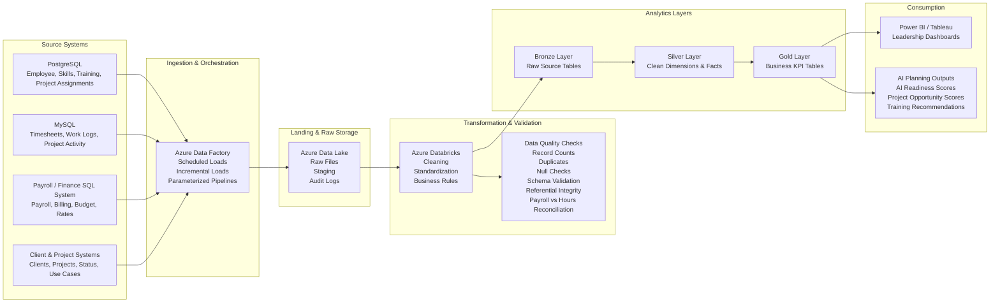

---

## Internal AI Agent Opportunities Supported by This Analysis

This analytics work supports planning and prioritization for internal AI Agent use cases such as:

- **AI Use Case Discovery Agent:** Identifies repetitive, manual, documentation-heavy, or reporting-heavy project work that could be automated.
- **Employee AI Training Recommendation Agent:** Recommends employees for AI upskilling based on project history, education, tools, skills, certifications, and training exposure.
- **Project Staffing Recommendation Agent:** Matches employees to future AI or automation projects using client familiarity, technology exposure, project history, and prior delivery experience.
- **Project Delivery Risk Agent:** Flags projects with high effort, low completion progress, staffing risk, timeline risk, rising payroll cost, or high non-billable hours.
- **Data Quality Review Agent:** Reviews duplicate records, missing fields, source-to-target checks, validation failures, and reporting readiness before dashboards are published.

This analysis does not represent a production AI Agent build. It represents the analytics and data-readiness work needed before a company can decide which AI Agents to build, which projects should be prioritized, which employees can support them, and how training or implementation timelines should be planned.

---

## Data Sources Used in the Analysis

The project combines data from multiple operational and business systems. Each source supports a different part of the workforce, project, payroll, skills, and AI-readiness analysis.

### PostgreSQL — Employee, Skills, and Project Application Data

PostgreSQL can be used for operational application data such as employee profiles, project assignments, skills, training, and technology exposure.

Example source tables:

```text
employees
employee_education
employee_location
employee_roles
employee_skills
training_records
certifications
technology_exposure
project_assignments
```

Business use:

```text
Used to understand employee background, skills, training completion,
technology exposure, project participation, and AI-readiness inputs.
```

---

### MySQL — Timesheet, Work Logs, and Project Activity Data

MySQL can be used for transactional or application-level data such as timesheets, task tracking, project activity, and work logs.

Example source tables:

```text
timesheet_entries
work_logs
project_tasks
project_status_updates
project_activity
use_case_submissions
billable_hours
non_billable_hours
```

Business use:

```text
Used to analyze employee hours, project effort, billable vs non-billable time,
manual work patterns, and project workload trends.
```

---

### Payroll / Finance SQL System

Payroll and billing data may come from a separate SQL-based finance or payroll system.

Example source tables:

```text
payroll_monthly
hourly_rates
billing_rates
salary_cost
client_billing
project_budget
project_financials
```

Business use:

```text
Used to estimate project labor cost, billing value, project margin,
payroll impact, and cost-heavy projects that may benefit from automation.
```

---

### Client and Project Systems

Client and project data may come from project management tools, CRM systems, or consulting delivery platforms.

Example source tables:

```text
clients
client_contracts
projects
project_status
project_milestones
project_use_cases
project_deliverables
```

Business use:

```text
Used to evaluate project status, client workload, project completion,
contract type, delivery risk, and AI opportunity by project or use case.
```

---

## Pipeline Architecture

The analytics pipeline was designed to move data from multiple source systems into a cleaned, validated, and reporting-ready structure.

```text
PostgreSQL / MySQL / Payroll SQL Systems
        ↓
Azure Data Factory
        ↓
Azure Data Lake Landing Zone
        ↓
Azure Databricks
        ↓
Bronze / Silver / Gold Analytics Layers
        ↓
Curated KPI Tables
        ↓
Power BI / Tableau Dashboards
        ↓
AI Agent Planning & Leadership Decision Support
```

---

## Flow Diagram



---

## Pipeline Stages

### Stage 1: Source Systems

Source data comes from multiple relational and operational systems.

```text
PostgreSQL
→ employee profiles, skills, training, technology exposure, project assignments

MySQL
→ timesheets, work logs, project tasks, use case submissions, project updates

Payroll SQL System
→ payroll cost, hourly rates, billing rates, salary cost, budget data

Client / Project Systems
→ project status, client data, project milestones, project deliverables
```

---

### Stage 2: Azure Data Factory Pipelines

Azure Data Factory is used to ingest data from PostgreSQL, MySQL, payroll systems, and project/client systems into the landing zone.

Pipeline activities include:

```text
Scheduled loads
Incremental loads
Parameterized pipelines
Source-to-target extraction
Pipeline orchestration
Audit logging
Failure notifications
```

Example raw outputs:

```text
employee_raw
timesheet_raw
project_raw
payroll_raw
skills_raw
training_raw
client_raw
project_use_case_raw
```

---

### Stage 3: Azure Data Lake Landing Zone

The landing zone stores raw and staged data before transformation.

Example landing structure:

```text
/raw/postgres/employees/
/raw/postgres/skills/
/raw/mysql/timesheets/
/raw/mysql/project_activity/
/raw/payroll/payroll_monthly/
/raw/client/projects/
/audit/pipeline_logs/
/quality/validation_results/
```

Purpose:

```text
Store raw extracted data
Maintain audit history
Separate raw data from cleaned data
Support reprocessing if needed
Store validation and quality results
```

---

### Stage 4: Azure Databricks Transformation

Azure Databricks is used to clean, standardize, join, validate, and transform the data into analytics-ready models.

Transformation activities include:

```text
Standardize employee names and IDs
Clean project and client names
Remove duplicate timesheet records
Normalize skill and technology names
Align payroll month to work month
Join project, employee, client, payroll, and skills data
Calculate billable hours, cost, margin, utilization, and AI-readiness scores
Create curated datasets for BI reporting
```

---

## Medallion-Style Data Layers

### Bronze Layer — Raw Ingested Data

Example tables:

```text
bronze_employee_raw
bronze_timesheet_raw
bronze_project_raw
bronze_client_raw
bronze_payroll_raw
bronze_skill_raw
bronze_training_raw
bronze_project_use_case_raw
```

Purpose:

```text
Store source-level raw data
Preserve original fields
Enable audit and traceability
Support reprocessing when business rules change
```

---

### Silver Layer — Cleaned and Modeled Data

Example tables:

```text
dim_employee
dim_client
dim_project
dim_skill
fact_timesheet
fact_payroll
fact_training
fact_project_use_case
bridge_employee_skill
```

Purpose:

```text
Clean inconsistent data
Deduplicate records
Standardize names and statuses
Apply data type validation
Build conformed dimensions and fact tables
Prepare reusable analytics models
```

---

### Gold Layer — Business Metrics and KPI Tables

Example tables:

```text
employee_allocation_kpi
project_profitability_kpi
ai_readiness_score
project_ai_opportunity
delivery_risk_summary
employee_training_priority
client_effort_summary
project_staffing_recommendation
```

Purpose:

```text
Store business-ready metrics
Support dashboards and reporting
Create AI-readiness and project opportunity scores
Enable leadership decision-making
Reduce dashboard calculation complexity
```

---

## Data Quality and Validation Checks

Data quality checks are applied before the data is used for dashboards, AI-readiness scoring, or leadership reporting.

### Record Count Reconciliation

Validates that source and target counts match after ingestion.

```sql
SELECT
    'timesheet_entries' AS table_name,
    src.source_count,
    tgt.target_count,
    src.source_count - tgt.target_count AS count_difference
FROM (
    SELECT COUNT(*) AS source_count
    FROM source_mysql.timesheet_entries
) src
CROSS JOIN (
    SELECT COUNT(*) AS target_count
    FROM bronze_timesheet_raw
) tgt;
```

---

### Duplicate Check

Identifies duplicate business keys that could inflate hours, payroll, cost, or utilization metrics.

```sql
SELECT
    employee_id,
    project_id,
    work_date,
    COUNT(*) AS duplicate_count
FROM fact_timesheet
GROUP BY
    employee_id,
    project_id,
    work_date
HAVING COUNT(*) > 1;
```

---

### Mandatory Field Check

Validates required fields before reporting.

```sql
SELECT
    COUNT(*) AS missing_required_field_count
FROM fact_timesheet
WHERE employee_id IS NULL
   OR project_id IS NULL
   OR work_date IS NULL
   OR hours_worked IS NULL;
```

---

### Referential Integrity Check

Confirms fact records have matching dimension records.

```sql
SELECT
    f.employee_id,
    COUNT(*) AS missing_employee_dimension_count
FROM fact_timesheet f
LEFT JOIN dim_employee e
    ON f.employee_id = e.employee_id
WHERE e.employee_id IS NULL
GROUP BY
    f.employee_id;
```

---

### Payroll vs Hours Reconciliation

Validates that payroll and timesheet data align by employee and month.

```sql
SELECT
    t.employee_id,
    DATE_TRUNC('month', t.work_date) AS work_month,
    SUM(t.hours_worked) AS total_hours_worked,
    p.salary_cost,
    p.hourly_cost
FROM fact_timesheet t
LEFT JOIN fact_payroll p
    ON t.employee_id = p.employee_id
   AND DATE_TRUNC('month', t.work_date) = p.payroll_month
GROUP BY
    t.employee_id,
    DATE_TRUNC('month', t.work_date),
    p.salary_cost,
    p.hourly_cost
HAVING p.salary_cost IS NULL
    OR p.hourly_cost IS NULL;
```

---

## Dashboard and Reporting Outputs

### Executive AI Readiness Dashboard

```text
Total active projects
Total employee hours
Total payroll cost
AI-ready employee count
Strong AI Agent candidate projects
Automation opportunity hours
Top clients by AI opportunity
Estimated effort reduction opportunity
```

---

### Workforce AI Training Dashboard

```text
Employees by AI-readiness score
Skills by department
Python / SQL / cloud / AI exposure
Training completion rate
Employees needing foundational AI training
Employees ready for AI Agent proof-of-concept work
```

---

### Project AI Opportunity Dashboard

```text
Project AI opportunity score
Manual effort hours
Repetitive task score
Documentation readiness
Data availability score
Business value score
Client impact
AI recommendation status
```

---

### Client Delivery and Resource Dashboard

```text
Hours by client
Payroll cost by client
Employee allocation by client
Projects near completion
Delivery risk projects
Margin by project
Billable vs non-billable hours
```

---

## Business Outcomes

This analytics pipeline supports:

```text
Identify AI Agent opportunities
Prioritize employee upskilling
Match employees to AI use cases
Track project effort, cost, and risk
Support leadership planning
Improve workforce allocation visibility
Estimate AI implementation readiness
Identify projects with repetitive manual effort
Improve project staffing decisions
```
