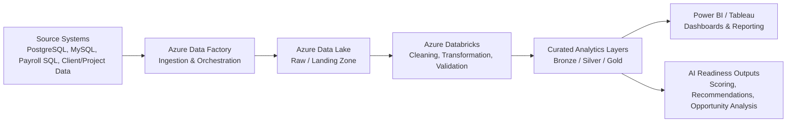

## Executive Pipeline Flow Diagram

### Diagram Explanation

This diagram represents the end-to-end analytics pipeline used to support the AI Workforce & Project Readiness Analysis.

Data is collected from multiple source systems, including PostgreSQL, MySQL, payroll databases, and client or project management systems. These sources contain employee, project, timesheet, payroll, skills, training, and client-related data required for workforce and project analysis.

Azure Data Factory is used to orchestrate and ingest the source data into Azure Data Lake, where the raw data is stored in a landing zone. From there, Azure Databricks is used to clean, standardize, validate, and transform the data into analytics-ready models.

The transformed data is organized into curated analytics layers such as Bronze, Silver, and Gold, which support reusable reporting structures and KPI-driven analysis. These curated outputs are then consumed in Power BI or Tableau dashboards for leadership reporting.

The same curated analytical layer also supports AI-readiness outputs such as employee AI-readiness scores, project opportunity scoring, delivery risk indicators, training recommendations, and internal AI Agent planning use cases.
