<!--
===============================================================================
Project: Python Pipeline Validation & Data Quality Monitoring Framework

Purpose:
This portfolio case study represents my exposure to data engineering workflows,
pipeline validation, data quality monitoring, SQL validation, Python-based issue
classification, and reporting-readiness checks in enterprise analytics environments.

This is a recreated portfolio project using generic field names, sample logic,
and non-confidential examples. No proprietary data, internal table names, or
sensitive business logic are included.
===============================================================================
-->

---

## Project Overview

This project represents my working exposure to pipeline validation, data quality monitoring, and reporting-readiness checks in an enterprise analytics environment.

Although my core role is Data Analyst / BI Developer, I worked closely with data engineering workflows where business reporting requirements had to be translated into technical data requirements, validation rules, pipeline checks, and curated reporting outputs.

The project demonstrates how Python and SQL can be used together to support reliable data delivery before business dashboards are refreshed.

The focus is not only on writing code, but also on understanding the full data flow from business requirements to source systems, pipelines, cloud storage, transformation layers, validation checks, and final reporting outputs.

---

## My Role & Exposure

My exposure included:

- Gathering business requirements, KPIs, and reporting needs from stakeholders
- Translating business needs into technical data requirements
- Understanding how source data moves through pipeline stages
- Reviewing Bronze, Silver, and Gold layer outputs
- Using SQL for validation checks and business-rule review
- Using Python-style logic for pipeline monitoring and exception reporting
- Reviewing failed loads, delayed refreshes, missing data, duplicate records, and schema issues
- Documenting validation logic, known issues, acceptance criteria, and reporting dependencies
- Supporting communication between business users, data engineering teams, and BI teams
- Helping ensure reporting datasets were trusted before being consumed in Power BI, Tableau, SSRS, or ad hoc SQL analysis

This project is positioned from the perspective of a data analyst with strong business understanding and working exposure to analytics engineering and data engineering processes.

---

# End-to-End Data Flow

~~~
Business Users / Stakeholders
        ↓
Business requirements, KPIs, and reporting needs
        ↓
Jira / Confluence
User stories, acceptance criteria, mappings, validation rules, documentation
        ↓
Data Engineering Team
Technical requirements and pipeline implementation
        ↓
Source Systems
SAP / on-prem systems / enterprise databases
        ↓
Azure Data Factory Pipeline
Pipeline orchestration and scheduled ingestion
        ↓
Lookup Activity
Reads metadata/control table to determine what should be loaded
        ↓
Copy Activity + SHIR
Moves data from SAP/on-prem systems through Self-Hosted Integration Runtime
        ↓
ADLS Gen2 Landing / Bronze Layer
Raw data lands for traceability and audit
        ↓
Databricks Silver Layer
Data is cleaned, standardized, validated, and structured
        ↓
Databricks Gold Layer
Business-ready curated data is prepared
        ↓
Azure SQL / Synapse
Final structured data is made available for downstream reporting
        ↓
Power BI / Tableau / Reporting
Dashboards, KPI tracking, ad hoc analysis, and business insights
~~~

---

## Executive Flow Diagram

```mermaid
flowchart LR
    A["Business Users<br/>KPIs and Reporting Needs"]
    B["Jira and Confluence<br/>Stories, Rules, Documentation"]
    C["Source Systems<br/>SAP, On-Prem, Enterprise Databases"]
    D["Azure Data Factory<br/>Lookup and Copy Activity"]
    E["SHIR<br/>Secure On-Prem Connectivity"]
    F["ADLS Gen2<br/>Landing and Bronze"]
    G["Databricks Silver<br/>Cleaning and Validation"]
    H["Databricks Gold<br/>Curated Business Data"]
    I["Azure SQL or Synapse<br/>Structured Reporting Layer"]
    J["Power BI or Tableau<br/>Dashboards and Insights"]

    A --> B
    B --> C
    C --> D
    D --> E
    E --> F
    F --> G
    G --> H
    H --> I
    I --> J
```


## Diagram Explanation

This diagram shows how business reporting requirements move through a real-world data engineering and analytics workflow.

Business users define KPIs, reporting needs, and dashboard expectations. Those requirements are documented through Jira and Confluence as user stories, acceptance criteria, data mappings, validation rules, and known limitations.

The data engineering team then builds or supports pipelines that extract data from source systems such as SAP, on-prem systems, or enterprise databases. Azure Data Factory orchestrates the ingestion process. Lookup activities can read metadata or control tables to decide what should be loaded, and Copy Activities can move data through Self-Hosted Integration Runtime when the source system is on-prem or behind a private network.

Data lands in ADLS Gen2, then moves through Databricks where it is cleaned, standardized, validated, and transformed into curated Silver and Gold datasets. Final structured datasets are made available through Azure SQL, Synapse, or BI-ready reporting layers for Power BI, Tableau, SSRS, and business analysis.

---

# ADLS Gen2 Landing and Delta Lake Storage

In the pipeline architecture, ADLS Gen2 is used as the cloud storage layer where source data is first landed before transformation.

The landing layer is typically kept close to the original source format. Depending on the source system and ingestion method, data may land as CSV, JSON, Parquet, Avro, or other flat-file formats.

The purpose of the landing layer is to preserve raw source data for auditability, traceability, and reprocessing.

After the data lands in ADLS Gen2, Databricks can process it and convert it into Delta format for Bronze, Silver, and Gold layers.

A common structure is:

~~~
Landing Layer
- Raw files from source systems
- CSV, JSON, Parquet, Avro, or source extracts
- Minimal transformation
- Used for audit and reprocessing

Bronze Layer
- Raw data converted into Delta tables
- Source-aligned structure
- Basic ingestion metadata added
- Useful for tracing back to the original source

Silver Layer
- Cleaned and standardized Delta tables
- Data types corrected
- Duplicate records handled
- Mandatory field checks applied
- Business keys standardized
- Data becomes easier to join and validate

Gold Layer
- Business-ready Delta tables
- KPI logic applied
- Curated datasets prepared for Power BI, Tableau, SSRS, Azure SQL, or Synapse
- Used for dashboards, reporting, and stakeholder analysis
~~~

Delta format is commonly used in Databricks because it supports ACID transactions, schema enforcement, schema evolution, time travel, merge/upsert logic, and reliable incremental processing.

Excel files may be used for small business reference files, mapping files, or one-time uploads, but they are usually not preferred for automated enterprise-grade pipelines.

---

# Where SQL Fits In

SQL is used to validate whether data is accurate, complete, and ready for reporting.

SQL supports:

~~~
Source-to-target validation
Duplicate checks
Null checks
Date range checks
Business rule validation
Bronze vs Silver comparison
Silver vs Gold comparison
KPI reconciliation
Ad hoc issue investigation
Reporting-layer validation
~~~

SQL is especially useful when business users question dashboard numbers or when data needs to be traced across source, staging, and reporting layers.

---

## SQL Example 1: Source-to-Target Row Count Validation

```sql
SELECT
    'sales_data' AS dataset_name,
    src.source_record_count,
    tgt.target_record_count,
    src.source_record_count - tgt.target_record_count AS record_count_difference,
    CASE
        WHEN src.source_record_count = tgt.target_record_count THEN 'Passed'
        ELSE 'Review Required'
    END AS validation_status
FROM (
    SELECT COUNT(*) AS source_record_count
    FROM source_system.sales_extract
) src
CROSS JOIN (
    SELECT COUNT(*) AS target_record_count
    FROM bronze.sales_raw
) tgt;
```

### Business Purpose

This check confirms that the number of records extracted from the source matches the number of records loaded into the Bronze layer.

---

## SQL Example 2: Duplicate Business Key Check

```sql
SELECT
    product_id,
    store_id,
    sales_date,
    COUNT(*) AS duplicate_count
FROM silver.sales_cleaned
GROUP BY
    product_id,
    store_id,
    sales_date
HAVING COUNT(*) > 1;
```

### Business Purpose

This check helps identify duplicate records that could inflate sales, inventory, or KPI reporting.

---

## SQL Example 3: Mandatory Field Check

```sql
SELECT
    COUNT(*) AS missing_required_field_count
FROM silver.sales_cleaned
WHERE product_id IS NULL
   OR store_id IS NULL
   OR sales_date IS NULL
   OR sales_amount IS NULL;
```

### Business Purpose

This check ensures required fields are available before the dataset is used in dashboards.

---

## SQL Example 4: Bronze vs Silver Validation

```sql
SELECT
    b.product_id,
    b.store_id,
    b.sales_date,
    b.sales_amount AS bronze_sales_amount,
    s.sales_amount AS silver_sales_amount,
    b.sales_amount - s.sales_amount AS amount_difference
FROM bronze.sales_raw b
LEFT JOIN silver.sales_cleaned s
    ON b.product_id = s.product_id
   AND b.store_id = s.store_id
   AND b.sales_date = s.sales_date
WHERE ABS(b.sales_amount - s.sales_amount) > 0.01;
```

### Business Purpose

This helps validate that transformation logic did not unexpectedly change the business value.

---

## SQL Example 5: Pipeline Validation Summary

```sql
SELECT
    validation_check,
    dataset_name,
    issue_count,
    CASE
        WHEN issue_count = 0 THEN 'Passed'
        WHEN issue_count BETWEEN 1 AND 100 THEN 'Review'
        ELSE 'Failed'
    END AS validation_status
FROM gold.data_quality_summary
ORDER BY
    validation_status,
    issue_count DESC;
```

### Business Purpose

This produces a business-friendly summary of validation results before reporting refresh.

---

# Where Python Fits In

Python is used as a monitoring and automation layer.

Python supports:

~~~
Reading pipeline run logs
Reading validation result files
Detecting failed jobs
Detecting delayed refreshes
Identifying SLA breaches
Detecting zero-record loads
Classifying data quality issues
Assigning severity levels
Creating executive summaries
Exporting exception reports
~~~

The goal is not to replace Azure Data Factory, Databricks, or SQL. The goal is to use Python to monitor outputs, classify issues, and create summarized reporting-risk views that are easier for data engineering, BI, and business teams to review.

---

# Python Script Examples

The Python script can read pipeline logs, row-count validation outputs, and schema validation results. It then classifies issues and creates reporting-ready monitoring files.

---

## Python Example 1: Configuration

```python
from dataclasses import dataclass

@dataclass(frozen=True)
class MonitoringConfig:
    pipeline_log_file: str = "sample_pipeline_run_logs.csv"
    row_count_file: str = "sample_row_count_validation.csv"
    schema_check_file: str = "sample_schema_validation.csv"
    output_folder: str = "pipeline_monitoring_outputs"
    sla_threshold_minutes: int = 60
    row_count_tolerance_pct: float = 5.0
```

### Purpose

This makes the monitoring framework reusable. SLA limits, tolerance rules, and input files can be managed from one configuration object.

---

## Python Example 2: Clean Pipeline Logs

```python
import pandas as pd

def clean_pipeline_logs(pipeline_df: pd.DataFrame) -> pd.DataFrame:
    df = pipeline_df.copy()

    datetime_columns = [
        "scheduled_start_time",
        "actual_start_time",
        "actual_end_time",
    ]

    for column in datetime_columns:
        df[column] = pd.to_datetime(df[column], errors="coerce")

    df["run_status"] = (
        df["run_status"]
        .fillna("UNKNOWN")
        .str.strip()
        .str.upper()
    )

    df["records_loaded"] = pd.to_numeric(
        df["records_loaded"],
        errors="coerce"
    ).fillna(0)

    df["run_duration_minutes"] = (
        (df["actual_end_time"] - df["actual_start_time"])
        .dt.total_seconds()
        .div(60)
    )

    df["start_delay_minutes"] = (
        (df["actual_start_time"] - df["scheduled_start_time"])
        .dt.total_seconds()
        .div(60)
    )

    return df
```

### Purpose

This step standardizes pipeline log data so it can be used for SLA checks and failure detection.

---

## Python Example 3: SLA Breach Detection

```python
import numpy as np

def evaluate_pipeline_sla(
    pipeline_df: pd.DataFrame,
    sla_threshold_minutes: int = 60
) -> pd.DataFrame:
    df = pipeline_df.copy()

    df["is_failed"] = df["run_status"].isin(["FAILED", "ERROR", "CANCELLED"])
    df["is_late_start"] = df["start_delay_minutes"] > sla_threshold_minutes
    df["is_long_running"] = df["run_duration_minutes"] > sla_threshold_minutes

    df["is_zero_record_load"] = (
        (df["records_loaded"] == 0)
        & (~df["run_status"].isin(["SKIPPED", "NO_DATA"]))
    )

    df["sla_status"] = np.select(
        [
            df["is_failed"],
            df["is_late_start"],
            df["is_long_running"],
            df["is_zero_record_load"],
        ],
        [
            "Failed",
            "Late Start",
            "Long Running",
            "Zero Record Load",
        ],
        default="Passed",
    )

    return df
```

### Purpose

This detects pipeline issues that may impact reporting readiness.

---

## Python Example 4: Row Count Validation

```python
def evaluate_row_count_quality(
    row_count_df: pd.DataFrame,
    tolerance_pct: float = 5.0
) -> pd.DataFrame:
    df = row_count_df.copy()

    df["row_count_difference"] = (
        df["target_row_count"] - df["source_row_count"]
    )

    df["row_count_difference_pct"] = np.where(
        df["source_row_count"] == 0,
        0,
        (df["row_count_difference"] / df["source_row_count"]) * 100
    )

    df["row_count_status"] = np.where(
        df["row_count_difference_pct"].abs() > tolerance_pct,
        "Row Count Mismatch",
        "Passed"
    )

    return df
```

### Purpose

This identifies whether data loaded into the target layer is materially different from the source.

---

## Python Example 5: Schema Drift Detection

```python
def evaluate_schema_drift(schema_df: pd.DataFrame) -> pd.DataFrame:
    df = schema_df.copy()

    df["is_missing_column"] = df["column_exists_flag"].str.upper() != "Y"

    df["is_data_type_mismatch"] = (
        df["expected_data_type"].str.lower()
        != df["actual_data_type"].str.lower()
    )

    df["schema_status"] = np.select(
        [
            df["is_missing_column"],
            df["is_data_type_mismatch"],
        ],
        [
            "Missing Column",
            "Data Type Mismatch",
        ],
        default="Passed",
    )

    return df
```

### Purpose

This identifies unexpected structure changes that can break downstream transformations or dashboards.

---

## Python Example 6: Issue Severity Classification

```python
def classify_issue_severity(issue_type: str, is_business_critical: bool) -> str:
    if issue_type == "Failed" and is_business_critical:
        return "Critical"

    if issue_type in ["Failed", "Missing Column", "Data Type Mismatch"]:
        return "High"

    if issue_type in ["Row Count Mismatch", "Zero Record Load"]:
        return "Medium"

    return "Low"
```

### Purpose

This converts technical validation issues into business-friendly severity levels.

---

## Python Example 7: Recommended Action Logic

```python
def recommend_action(issue_type: str) -> str:
    action_map = {
        "Failed": "Review pipeline failure logs and rerun after upstream issue is resolved.",
        "Late Start": "Review upstream dependency timing and SLA schedule.",
        "Long Running": "Review query performance, source latency, and transformation logic.",
        "Zero Record Load": "Validate source extract and confirm whether zero records are expected.",
        "Row Count Mismatch": "Compare source filters, incremental load window, and target load status.",
        "Missing Column": "Confirm upstream schema change and update downstream model dependencies.",
        "Data Type Mismatch": "Review source data type change and update casting logic."
    }

    return action_map.get(issue_type, "Review validation output and assign to data owner.")
```

### Purpose

This helps data teams move from issue detection to action.

---

# Sample Input Files

The framework can work with sample inputs like:

~~~
sample_pipeline_run_logs.csv
sample_row_count_validation.csv
sample_schema_validation.csv
~~~

---

## Example Pipeline Run Log Fields

~~~
pipeline_id
pipeline_name
source_system
target_table
data_domain
scheduled_start_time
actual_start_time
actual_end_time
run_status
records_loaded
error_message
~~~

---

## Example Row Count Validation Fields

~~~
validation_date
source_system
target_table
source_row_count
target_row_count
~~~

---

## Example Schema Validation Fields

~~~
validation_date
target_table
column_name
expected_data_type
actual_data_type
column_exists_flag
~~~

---

# Sample Output Files

The Python workflow can generate outputs like:

~~~
pipeline_sla_results.csv
row_count_validation_results.csv
schema_validation_results.csv
data_quality_issue_summary.csv
executive_monitoring_summary.csv
domain_issue_summary.csv
~~~

---

## Example Output: Executive Monitoring Summary

~~~
total_pipeline_runs
failed_pipeline_runs
late_pipeline_runs
long_running_pipeline_runs
zero_record_loads
row_count_mismatches
schema_issues
critical_issues
high_issues
medium_issues
low_issues
~~~

---

## Example Output: Data Quality Issue Summary

~~~
issue_source
issue_type
data_domain
source_system
target_table
severity
priority_score
issue_description
recommended_action
~~~

---

# Jira and Confluence Usage

Jira and Confluence are included because data pipeline work is not only technical. It also requires business alignment, documentation, prioritization, and issue tracking.

---

## Jira

Jira can be used to track:

~~~
Pipeline development tasks
Validation defects
Data quality issues
UAT feedback
Business rule clarification
Production support tickets
Enhancement requests
~~~

Example Jira story:

~~~
Story: Validate SAP sales data load into Silver layer

Acceptance Criteria:
- Source and target record counts are reviewed
- Required fields are populated
- Duplicate checks are completed
- Expected date range is available
- Output is approved for dashboard testing
~~~

---

## Confluence

Confluence can be used to document:

~~~
Business requirements
KPI definitions
Source-to-target mappings
Field definitions
Validation rules
Pipeline refresh notes
Known limitations
UAT sign-off notes
Reporting ownership
~~~

---

# Business Value

This framework helps data and BI teams answer:

~~~
Did the pipeline run successfully?
Did the data arrive on time?
Did the expected number of rows load?
Did the schema change?
Are required fields populated?
Are there critical issues before dashboard refresh?
Which data domain needs review first?
~~~

It helps translate technical issues into business-friendly reporting readiness messages:

~~~
Sales data is ready for reporting
Inventory data needs review
PO data loaded late
Pricing table has a schema issue
Dashboard refresh should be paused until validation is complete
~~~

---

# Portfolio Summary

This project demonstrates my exposure to the data engineering side of analytics delivery.

It shows how I can support the full reporting lifecycle:

~~~
Understand business requirements
Translate KPIs into data requirements
Work with Jira and Confluence for documentation and tracking
Understand source systems and pipeline flow
Support validation across Bronze, Silver, and Gold layers
Use SQL for record checks and business-rule validation
Use Python logic for pipeline monitoring and issue classification
Review data quality outputs before BI reporting
Help ensure Power BI, Tableau, and reporting datasets are trusted
~~~

This project reflects the hybrid value I bring as a data analyst with business knowledge, BI experience, SQL skills, Python exposure, and practical understanding of data engineering workflows.
